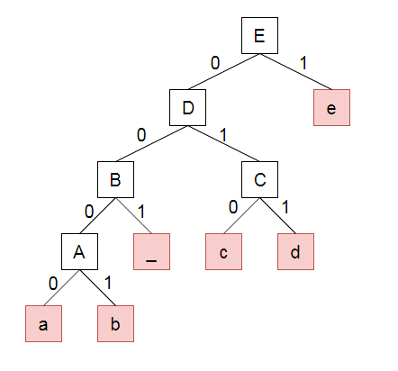

# Huffman Algoritm

대학교의 자료구조 시간에 압축 관련한 알고리즘을 들은 적이 있다. 가장 유명하다고 알려진 것이 허프만인데 아무래도 책에 있는 그림으로 알고리즘을 공부하기에 그림만 보아서는 어떻게 코드로 구현할지 그 당시엔 감이 오지 않았다.
생각해보면 그림만 보고서 코딩을 한다는 게 당연히 어렵고 그렇다고 인터넷을 참조해보아도 엄청나게 긴... 코드만 쳐다보다 바로 창을 꺼버리게 되어 항상 이해만 할 뿐 코드로서 잊힌 알고리즘이었다.

하지만 최근에 아는 지인으로부터 허프만 관련한 세미나를 요청하여 의지를 가지고 공부하였는데
생각보다 그렇게 어려운 방법은 아니ㄷ... 항상 처음이 중요한 거 같다..

그래서 이번 포스팅은 대학교 때 듣고 지나쳐온 허프만 알고리즘을 소개하고자 한다.

우선, 컴퓨터에서는 어떻게 데이터를 저장할 것인가를 생각해보자

예를 들어, ABABCA라는 문자열을 저장할 경우 아래와 같을 것이다.

1. 우선 가장 간단하고 기본적인 방법
문자는 아스키코드로 표현할 수 있으며, 이진수

| 문자 | 아스키코드 | 이진수 |
|-|-|-|
| A | 65 | 01000001 |
| B | 66 | 01000010 |
| C | 67 | 01000011 |

위 표에 따라 문자열 ABABCA는

|A|B|A|B|C|A|
|-|-|-|-|-|-|
|01000001|01000010|01000001|01000010|01000011|01000001|

**8 * 6개 = 48bit으로 저장 된다는것인데...** \\
사용되지 않는 문자까지 비트에 포함되어 매우 비효율적인 저장 방식이 될 것이다.

하지만 이런 비효율적인 저장 방식을 해결하고자 
허프만의 방식은 **자주 등장하는 문자는 작은 비트로 할당하여 저장하자**라는 
압축 알고리즘이다.

아래 표와 같이 문자에 비트를 할당해보자

| 문자 | 아스키코드 | 이진수 |
|-|-|-|
| A | 65 | 0 |
| B | 66 | 01 |
| C | 67 | 11 |

|A|B|A|B|C|A|
|-|-|-|-|-|-|
|0|01|0|01|11|0|

**9bit로 저장**되어 압축률은 9/48인 약 18.75%로 압축하여 저장이 가능하다. 정말 합리적이지 않은가?

그렇다면 자주 등장하는 문자를 어떻게 효율적으로 비트를 지정해야 할까?

해당 방법은 허프만 트리로 해결 가능하다.

